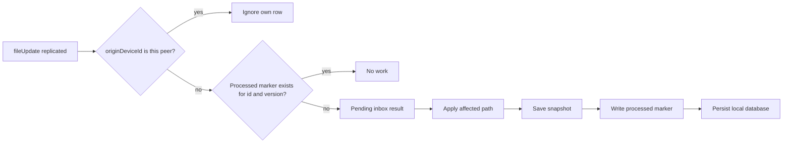
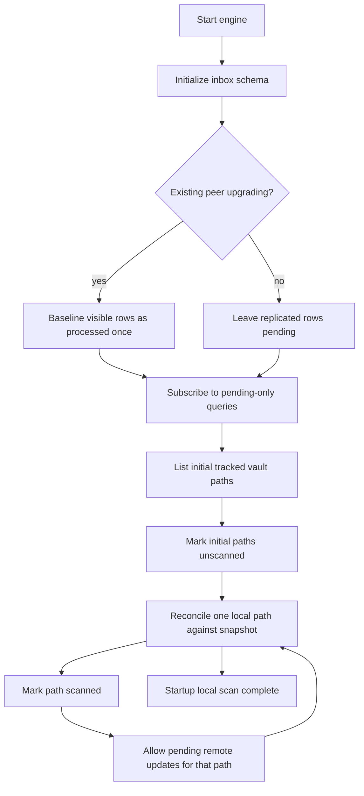
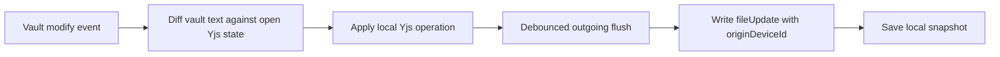
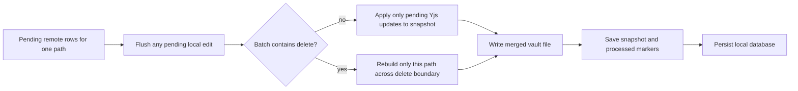

# LocalSync Startup and Sync Flow

LocalSync keeps the vault file, a local Yjs snapshot, and synced update rows in
agreement. Normal synchronization is incremental. Full-history reconstruction
is available only through the manual materialization repair action.

## Incremental Inbox

Each peer has local-only processed-marker tables. The subscribed query returns
only synced rows for which this peer has no marker matching `(id, row version)`.
This detects rows that replicate late even when their Evolu timestamp is older
than previously received rows.

The marker is written after vault and snapshot work. A crash before that point
leaves the row pending, so it is retried. Applying a Yjs update again is safe.

## Startup

For files with an existing local snapshot, the scan first compares the current
vault content hash with the hash stored beside the Yjs snapshot. Matching files
need no Yjs reconstruction or snapshot database write. A missing hash, as on
the first startup after upgrading, takes the full reconciliation path once and
backfills the hash.

Remote paths not present in the initial local file list can materialize as soon
as that list is known. Existing paths can materialize immediately after their
own local reconciliation completes; they do not wait for the entire vault.

The startup scan detects edits made while LocalSync was stopped. It does not
perform a global remote-history validation.

Obsidian reports scan progress as checked files over total tracked files.
Incremental materialization counts the complete pending file and setting
anti-joins only when either 500-row query page is full. Smaller catch-ups use
the returned page lengths directly, avoiding a full-history count during normal
sync. Materialization then reports applied rows over that backlog; large local
marker migrations report separately.

## Normal Local Edit

The originating peer filters its own row from the incoming inbox. Other peers
receive and apply it incrementally.

The durable marker version is `updatedAt ?? createdAt`: inserted Evolu rows
have no `updatedAt`, while deterministic rows gain one when changed later.

Renames cancel the old-path outgoing debounce, retarget the open Yjs state,
then send an old-path delete and a full-state update for the new path.

## Normal Remote Edit

Delete boundaries require a path-scoped reconstruction because a delete resets
the Yjs document. Ordinary content updates never replay path or vault history.

## Manual Validation

The Maintenance action remains the explicit full-history repair mechanism. It
scans synced rows, reconstructs path projections, and writes only when the vault
still matches the local snapshot. It is not called automatically at startup,
on focus, on timers, or after ordinary updates.
