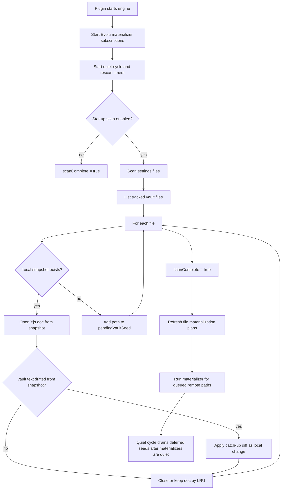
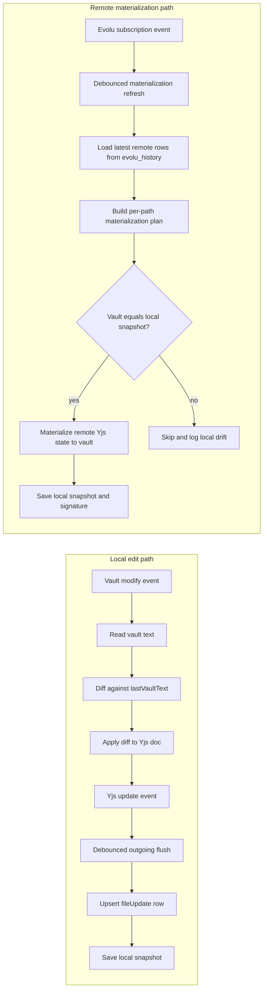
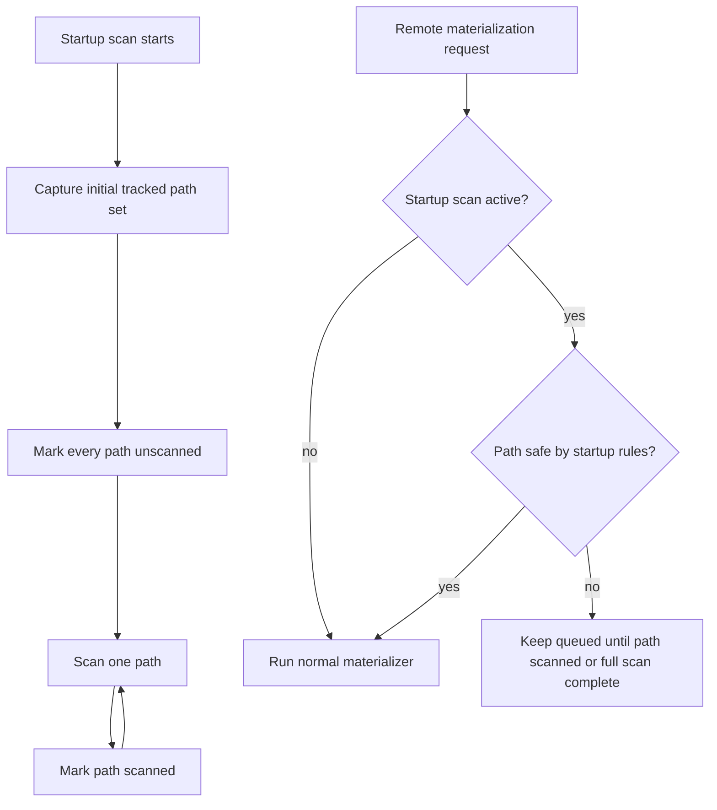

# LocalSync Startup and Sync Flow

This document describes the current materializer-based sync model and the UX
gap around remote updates during startup scans.

## Startup Flow

During `scanComplete = false`, file materialization refresh is intentionally
deferred. Evolu may receive remote rows locally, but vault writes wait until the
startup scan finishes.

## Normal Sync

## Current Startup Remote-Update Behavior

If a remote peer creates or edits a file while this peer is still scanning:

1. Evolu can replicate the row into the local database.
2. The subscription schedules a materialization refresh.
3. `refreshFileMaterializationPlans()` exits early while startup scan is not
   complete.
4. The remote change is materialized after the startup scan completes and the
   refresh is run again.

This is safe but poor UX for long scans: remote changes are invisible in the
vault until scan completion.

## Safe Future Direction

Receiving and materializing remote updates during startup can be safe only with
path-level scan state. The engine needs to know whether a path is already
classified by the scan before a remote write is allowed to touch the vault.

Candidate rules:

| Remote operation | Safe during startup? | Required condition |
|------------------|----------------------|--------------------|
| Create new path | Yes | Path is not in the startup scan's initial tracked file set. |
| Update existing path | Maybe | Path has already been scanned and vault still equals snapshot. |
| Delete existing path | Maybe | Path has already been scanned and vault still equals snapshot. |
| Update unscanned existing path | No | Could race with local drift catch-up. |
| Delete unscanned existing path | No | Could misclassify local-only state or offline edits. |

Implementation shape:

Without that path-level gate, the current full-scan gate is the safer behavior.
